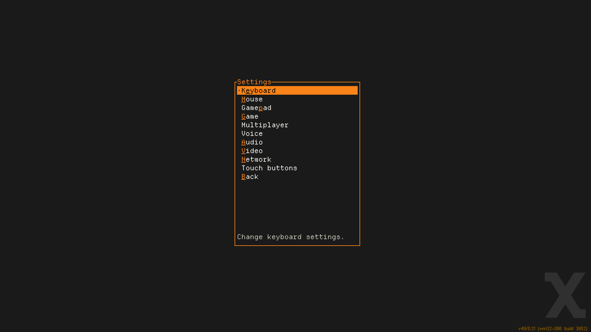
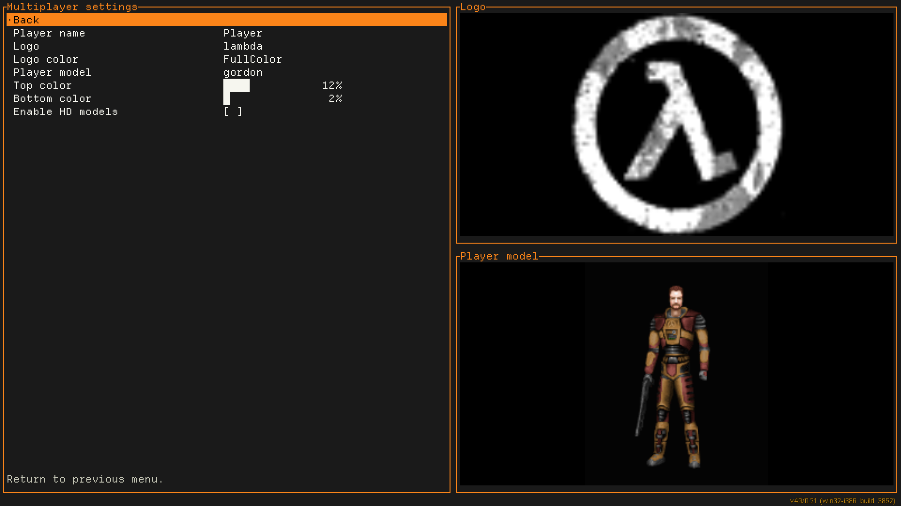
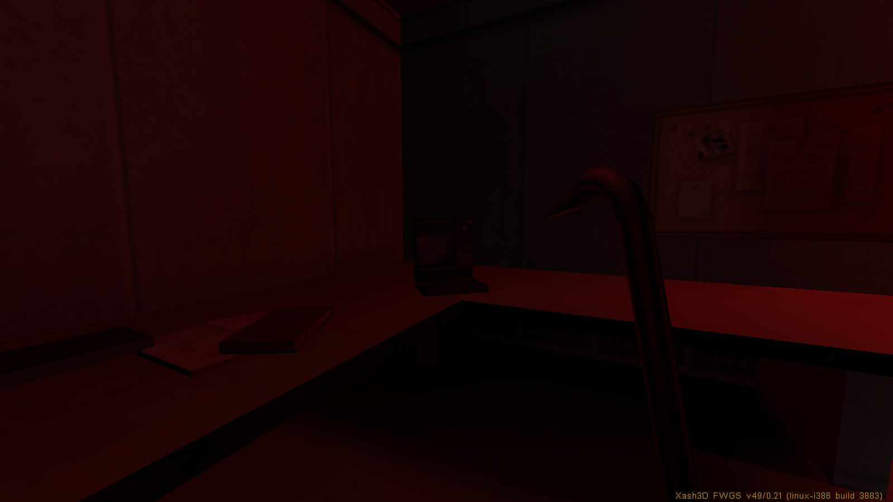
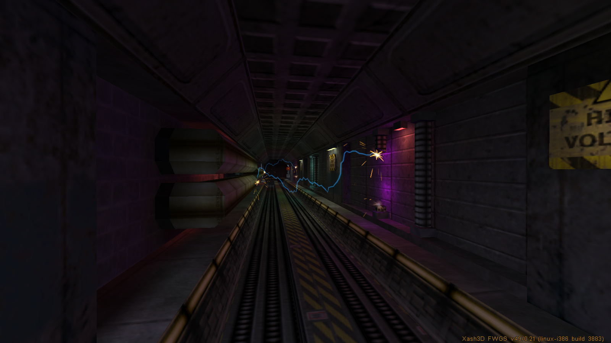
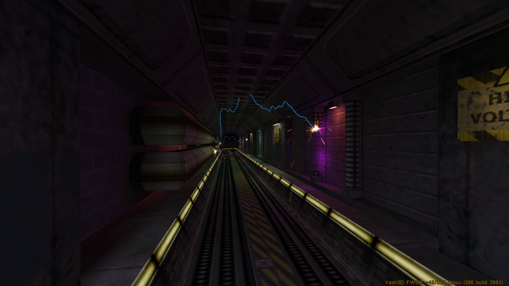

# Xash3D FWGS Status Update - December 2025

A look back at the progress made in Xash3D FWGS development during 2025.

Previous updates:

* [Xash3D FWGS - November 2022](https://velaron.github.io/xash3d-fwgs-november-2022.html)
* [Xash3D FWGS - November 2023](https://velaron.github.io/xash3d-fwgs-november-2023.html)
* [Xash3D FWGS Status Update - December 2024](https://snmetamorph.github.io/posts/xash3d-fwgs-dec-2024)

## Consider Donating

[a1batross](https://github.com/a1batross)

Initial Xash3D SDL2/Linux port author, Xash3D FWGS engine maintainer, creator of non-commercial Flying With Gauss organization.

* [Boosty page](https://boosty.to/a1ba)

[nekonomicon](https://github.com/nekonomicon)

[hlsdk-portable](https://github.com/FWGS/hlsdk-portable), [mdldec](../utils/mdldec), [opensource-mods.md](opensource-mods.md) maintainer and Xash3D FWGS [contributor](https://github.com/FWGS/xash3d-fwgs/commits?author=nekonomicon) (\*BSD/clang port, PNG support, etc).

* [Boosty page](https://boosty.to/nekonomicon)

[Velaron](https://github.com/Velaron)

[cs16-client](https://github.com/Velaron/cs16-client) \& [tf15-client](https://github.com/Velaron/tf15-client) maintainer and Xash3D FWGS [contributor](https://github.com/FWGS/xash3d-fwgs/commits?author=Velaron) (Android port, voice chat, etc).

* [Boosty page](https://boosty.to/velaron)

[SNMetamorph](https://github.com/SNMetamorph)

[PrimeXT](https://github.com/SNMetamorph/PrimeXT) \& [GoldSrc Monitor](https://github.com/SNMetamorph/goldsrc-monitor) maintainer and Xash3D FWGS [contributor](https://github.com/FWGS/xash3d-fwgs/commits?author=SNMetamorph) (Windows port, voice chat, etc).

* [Boosty page](https://boosty.to/snmetamorph)
* [Other donation methods](https://snmetamorph.github.io/donate)

[$_Vladislav](https://github.com/Vladislav4KZ)

[YaPB Project](https://github.com/yapb) member, [Xash3D FWGS](https://github.com/FWGS/xash3d-fwgs) tester, editor of the [Official YaPB Documentation](https://github.com/yapb/docs) (in English and Russian), curator of the [YaPB Graph Database](https://github.com/yapb/graph) and author of [YaPB Waypoint/Graph Pack](https://gamebanana.com/mods/40087).

Also does the Russian localization of text, images (gfx/shell), as well as additional menu buttons in English used in Xash3D FWGS for various mods.

* [Boosty page](https://boosty.to/rasstaman1337)

## FFmpeg based playback

by [**a1batross**](https://github.com/a1batross)

Xash3D FWGS now includes FFmpeg support, replacing the old Video for Windows backend. This means intro videos are no longer limited to the legacy 32-bit Windows build, they can now be played on other platforms too. The update also adds support for the WebM videos introduced in the Half-Life 25th Anniversary Update. On Android, however, FFmpeg is not included in the builds in order to keep the engine lightweight.

## TUI Main Menu

by [**numas13**](https://github.com/numas13)

A new text-based menu written in Rust arrived this year.  
It brings many advantages over traditional GUIs, such as reduced memory usage, reduced CPU usage, and improved navigation with a keyboard.

## GoldSrc voicechat support

by [**pwd491**](https://github.com/pwd491)

Xash players can now hear and talk to GoldSource players, as long as those GoldSource players are running the latest Steam version of the game. The Silk voice codec isn’t supported yet.

## GoldSrc spray customization support

by [**pwd491**](https://github.com/pwd491)

In the past, custom spraypaints didn’t work on GoldSrc servers. That changes now - even full-color spraypaints are supported!

## Mounting HD, Addon, Localization and Low Violence directories

by [**a1batross**](https://github.com/a1batross)

Now Xash can load content from the folders **gamedir_hd**, **gamedir_language**, **gamedir_addon**, and **gamedir_lv**.  
**gamedir** means the name of the game directory, such as *valve*, *gearbox*, *cstrike*, etc.  
**language** should be replaced with your language, for example *valve_russian*, *valve_brazilian*, and so on.  

List of cvars for mounting directories:

* `fs_mount_hd` – mounts the directory with HD models
* `fs_mount_l10n` – mounts the directory containing localization files
* `fs_mount_addon` – mounts the directory with custom content (similar to the *custom* folder inside the game directory)
* `fs_mount_lv` – mounts the directory with low-violence content

## Luma texture support in Half-Life

by [**a1batross**](https://github.com/a1batross)

The engine now supports fullbright/luma textures, identified by the `~` prefix in the texture name.  
It is disabled by default, but can be enabled by setting the ``r_allow_wad3_luma`` cvar to ``1``.

## Make Android build follow library naming scheme

by [**Flying with Gauss**](https://github.com/FWGS)

Android build of the engine now follows the unified library naming scheme used across Xash3D FWGS, including standardized prefixes, updated build scripts, and a more predictable native library lookup process.

## New iOS port

by [**ksagameng2**](https://github.com/ksagameng2)

A new iOS port of Xash3D FWGS is now available, featuring updated platform support and improved compatibility with modern iOS devices.

## Drop of legacy protocol

by [**Flying with Gauss**](https://github.com/FWGS)

As of December 1, 2025, support for Xash3D protocol 48 has been dropped, and players on the new engine will no longer be able to connect to servers hosted on the old engine.

## Deprecation and removal of linear/cubic audio upsampling

by [**a1batross**](https://github.com/a1batross)

In preparation for the upcoming mixer rewrite, upsampling filters have been moved out of scope, and `s_lerping` has been deprecated and removed. While the feature may return in the future, eliminating approximately 200 lines of legacy code of uncertain origin reduces complexity and improves maintainability.

## Fullscreen mode fixes

by [**a1batross**](https://github.com/a1batross)

In recent engine updates, several issues related to fullscreen mode have been fixed.  

Previously, when users enabled fullscreen, the game could actually remain in a window or start with an incorrect screen resolution. This issue was fixed in commit [4a16ca8](https://github.com/FWGS/xash3d-fwgs/commit/4a16ca8).  

Another issue caused the engine to get confused about the window state when exiting fullscreen. After switching to windowed mode, the window could have an incorrect size or behave as if it was still maximized. This was fixed in commit [ad01be8](https://github.com/FWGS/xash3d-fwgs/commit/ad01be8).

## Other minor changes

by [**Flying with Gauss**](https://github.com/FWGS)

* Fixed incorrect XashID generation on Windows due to uninitialized string ([51a9524](https://github.com/FWGS/xash3d-fwgs/commit/51a9524465e94ca406685b992ee87499269d95a6))
* Improved compatibility with GoldSrc-based clients behavior (thanks [**@Garey27**](https://github.com/Garey27)) ([62a49d2](https://github.com/FWGS/xash3d-fwgs/commit/62a49d234f76c27ff1ea23c31635196ce34354c8))
* Fix loading of dds with volume textures ([2736d1f](https://github.com/FWGS/xash3d-fwgs/commit/2736d1fd035b8364c73a928134c49cb01581163e))
* Attempt to automatically create .nomedia file in directory where games are located on Android ([6d987d0](https://github.com/FWGS/xash3d-fwgs/commit/6d987d083ea499f3698ea3324feed19b4de3909d))
* Fix TE_BLOODSPRITE behaviour to GoldSrc ([06e5895](https://github.com/FWGS/xash3d-fwgs/commit/06e5895d7aa47bb2f5fefdce3102e91771ad67aa))
* Introduce Platform_NanoSleep, to be used for better sleeping in between frames for lowering CPU usage ([merged in PR #2019](https://github.com/FWGS/xash3d-fwgs/pull/2019))
* Major rework of game directory scanning ([merged in PR #1947](https://github.com/FWGS/xash3d-fwgs/pull/1947))